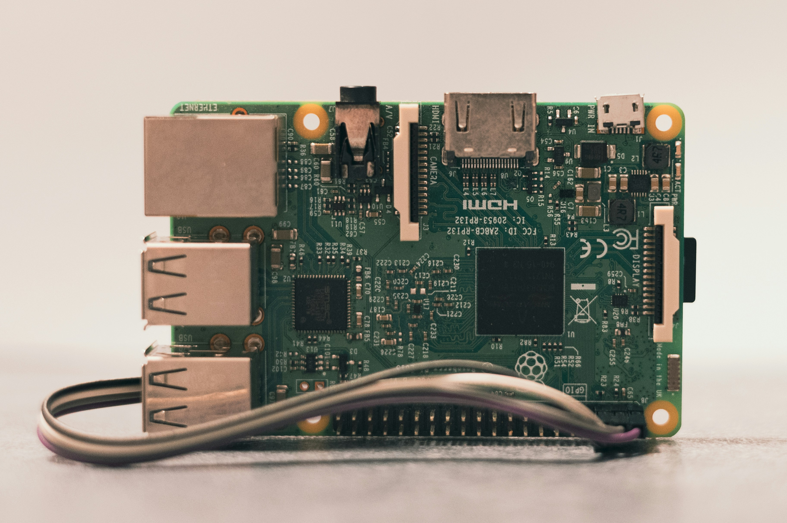
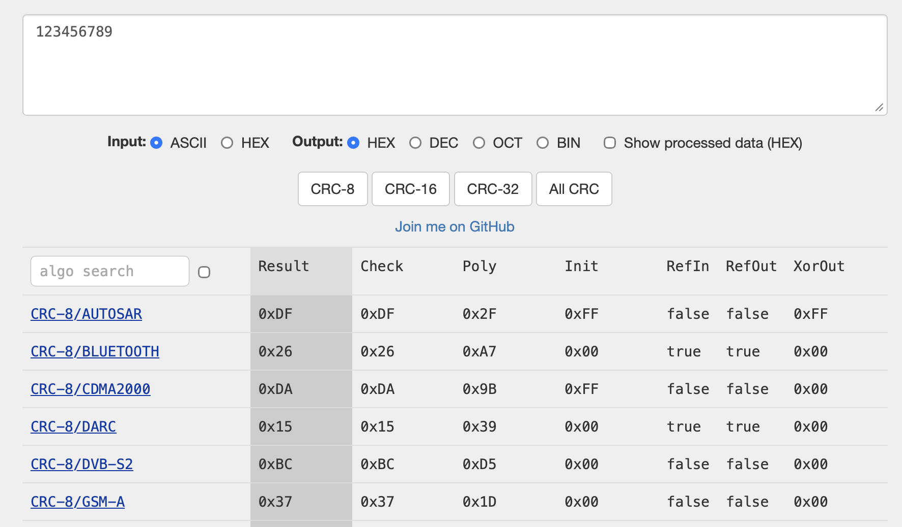
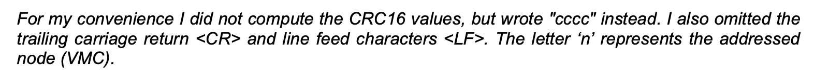
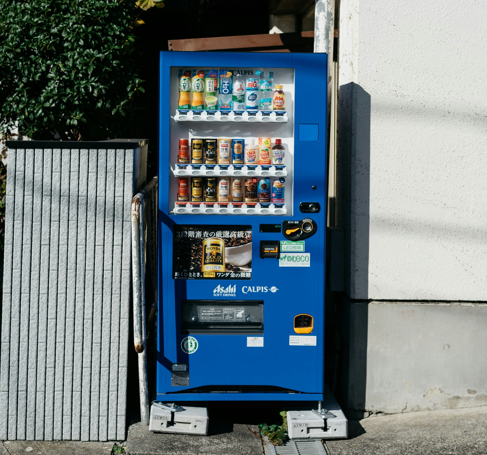

Er bestaan enorm veel checksum-implementaties. Nog vervelender: er kunnen ook aangepaste polynomen en niet-standaard checksums in omloop zijn. Gelukkig zijn de meeste van ons software-ontwikkelaars een beetje lui, dus gebruiken we meestal gewoon een bestaande implementatie.

Documentatie? Misschien als ik er zin in heb. Waar had ik die initial value ook alweer opgeschreven…

---

## Introductie

> Hij maakt verbinding op mijn apparaat!

Als je lang genoeg met embedded apparaten werkt, klinkt dit verhaal vast herkenbaar:

De documentatie zegt _“CRC16-checksum”_, misschien vermeldt het polynoom als je geluk hebt, maar dat is alles. Geen details over bytevolgorde, reflectie, initial value of final XOR. Je implementeert wat redelijk lijkt, maar de firmware blijft je pakketten afwijzen.

---

## Het CRC-verwarringsprobleem

Cyclic Redundancy Check is **geen** enkel algoritme; het kent veel varianten, elk gedefinieerd door meerdere parameters:

- **Polynoom**: de kern van de CRC-berekening
- **Initial value**: startpunt van de berekening
- **Reflected input/output**: bitvolgorde omkeren
- **Final XOR-waarde**: optionele laatste transformatie
- **Bytevolgorde**: least of most significant byte eerst

Zelfs twee CRC16-implementaties die hetzelfde polynoom gebruiken, kunnen verschillende resultaten geven als een van deze parameters anders is.

> Elke parameter beïnvloedt het eindresultaat

---

## Een eenvoudige truc: laat de data het werk doen

In plaats van te raden, kun je een pakket met een echte CRC gebruiken om de juiste variant te identificeren.

1. Leg een pakket vast met zowel de ruwe data als de daadwerkelijke CRC.
2. Ga naar [crccalc.com](https://crccalc.com).
3. Plak je data en probeer de verschillende CRC16-varianten.
4. Vergelijk de berekende checksum met de verwachte waarde totdat ze overeenkomen.

> crccalc.com laat je CRC16-varianten testen op basis van een bekend pakket.

Je kunt experimenteren met instellingen zoals reflectie, polynoom of initial value. crccalc werkt in real-time, waardoor trial-and-error veel sneller gaat.

---

## Praktijkvoorbeeld

Bij een recent project moesten we het communicatieprotocol van een oude snackautomaat doorgronden. Het voordeel was dat er documentatie bestond die het protocol beschreef. Het nadeel: het bedrijf bestond niet meer. De meeste documentatie was behoorlijk gedetailleerd, maar over de checksum stond slechts “CRC16”. Onze eerste drie implementaties kwamen niet overeen met de checksum van het apparaat.

> Ah, bedankt.

Gelukkig konden we het eerste bericht van het apparaat opvangen zonder dat er aan onze kant een CRC nodig was. Door het frame in crccalc.com te plakken en varianten te testen, ontdekten we al snel dat het **CRC16-ARC** was, big-endian. Toen we dat eenmaal wisten, verifieerden we het in de code — en de communicatie werkte perfect.

> Verbonden! Of toch niet?

---

## Waarom dit belangrijk is

Deze aanpak is onmisbaar wanneer je werkt met:

- **Onderdocumenteerde apparaten van derden**
- **Proprietaire protocollen**
- **Legacy-systemen** waarvan de documentatie onvolledig is

Eén enkel vastgelegd pakket is vaak al genoeg om de correcte CRC te identificeren.

> Deze sprak alleen Japans

---

## Slotgedachten

Het reverse-engineeren van checksums hoeft geen gokwerk te zijn. Tools zoals [crccalc.com](https://crccalc.com) maken het eenvoudig om CRC-parameters interactief te onderzoeken.

Als je vastloopt met “CRC-mismatch” fouten of een vage _CRC16_-vermelding in een datasheet, probeer dan deze methode — of neem contact op als je hulp nodig hebt bij een lastig protocol.

> Een snelle CRC-analyse bespaart uren debuggen.

---

## Hulp nodig bij CRC-problemen?

Als je werkt met **ondocumenteerde protocollen**, **CRC-mismatches**, of gewoon een snellere manier zoekt om checksums te analyseren, kunnen wij helpen.

- We kunnen je pakketten analyseren en de juiste CRC-variant bepalen.
- We bieden embedded-softwareconsultancy bij complexe hardware-integraties.
- We helpen je CRC-checks betrouwbaar te implementeren in je firmware.

📧 **Neem contact op via [altug@alsoft.nl](mailto:altug@alsoft.nl)**

💼 **Meer weten over onze [diensten](/nl/services)**
