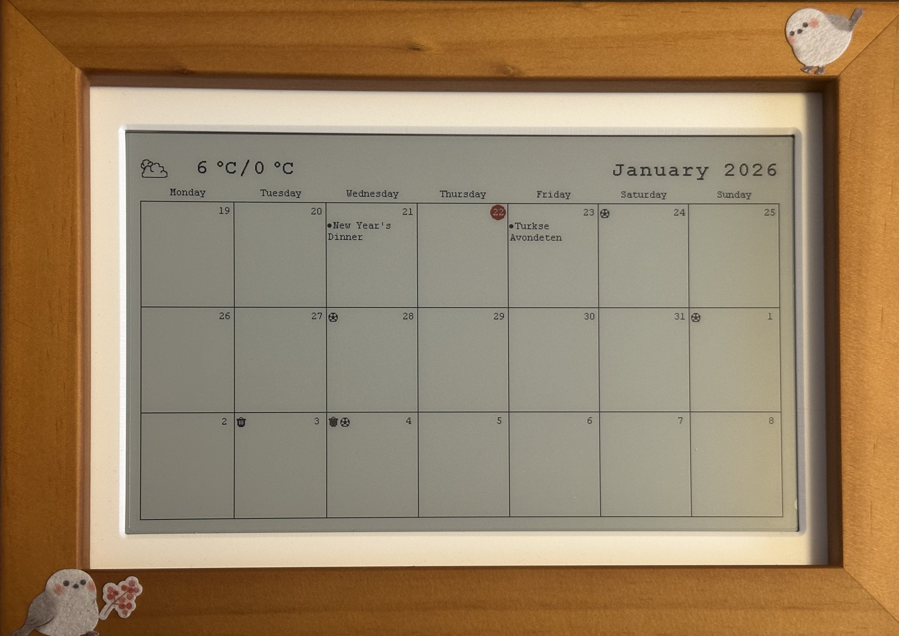
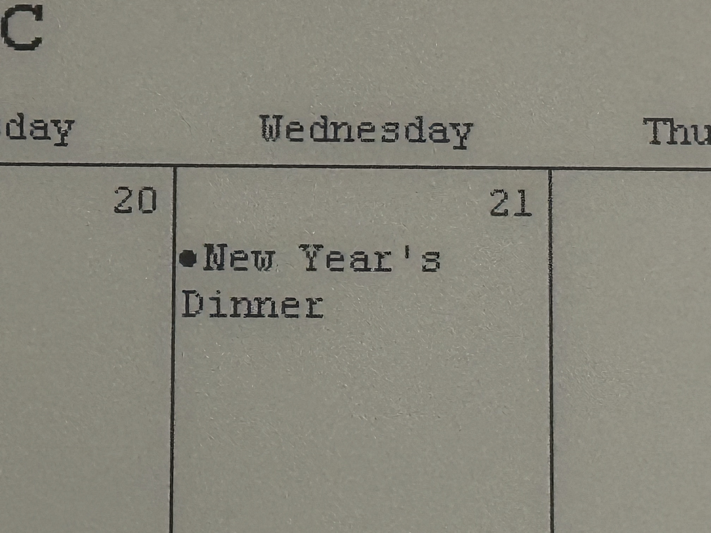
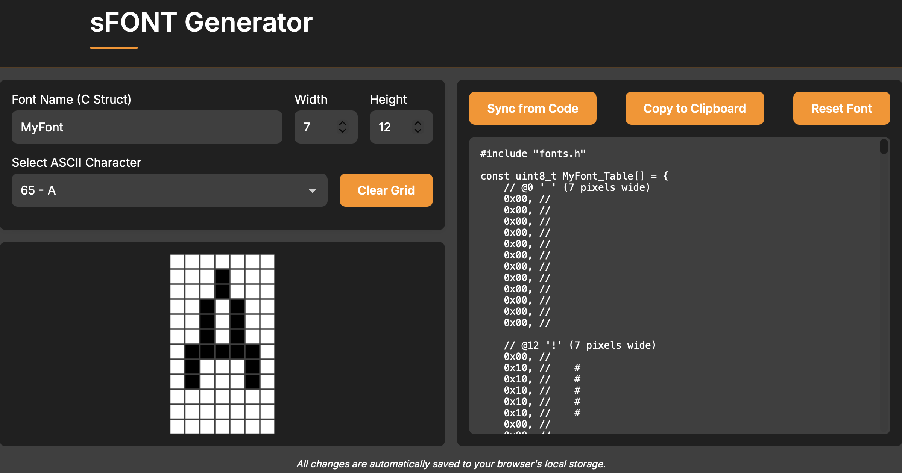
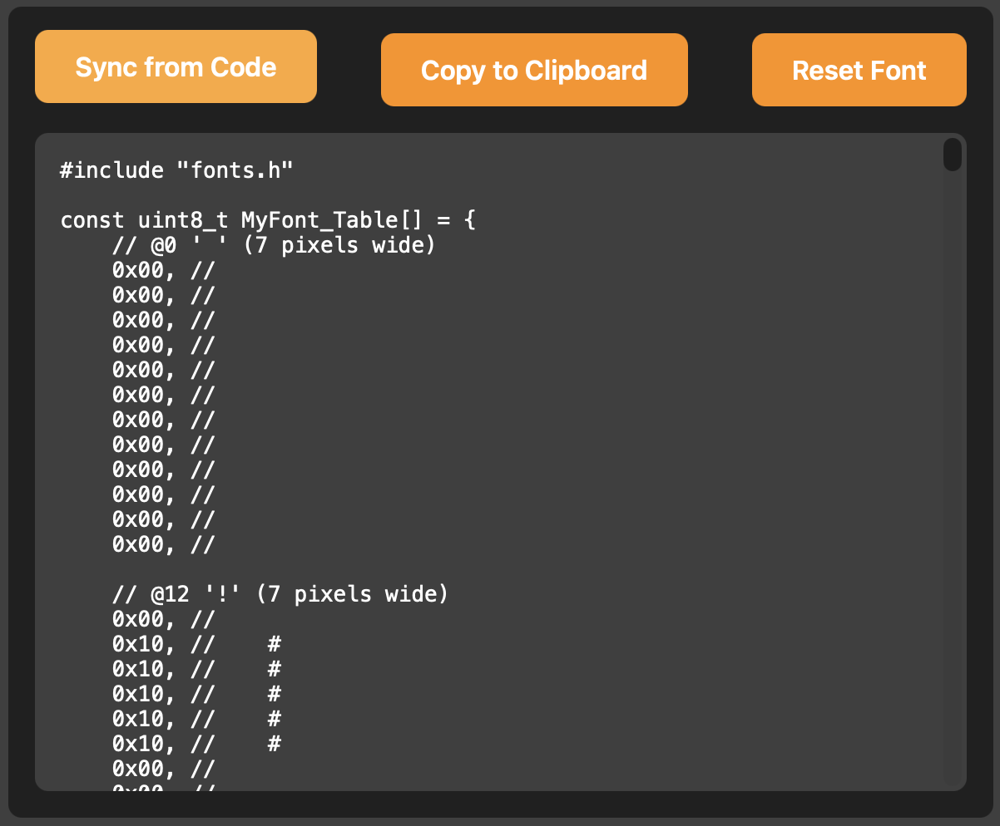
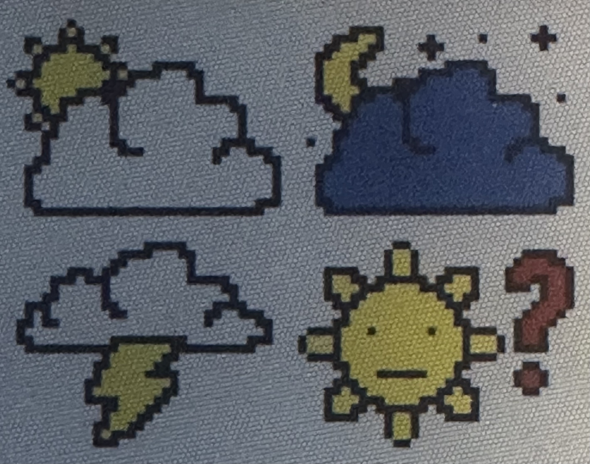

Als je ooit hebt gewerkt met STM32-microcontrollers en hun BSP-bibliotheken, ben je waarschijnlijk de `sFONT`-structuur tegengekomen. Het is een eenvoudige, efficiënte manier om bitmap-lettertypen op te slaan voor LCD-displays. Maar deze lettertypen aanmaken of aanpassen? Dat betekent meestal handmatig door hex-arrays spitten of op zoek gaan naar obscure desktop-tools.

Wij bouwden een browser-gebaseerde editor om dit makkelijker te maken.

---

## Wat is sFONT?



> Van STM32 LCD's tot Waveshare e-paper: sFONT is overal

Het sFONT-formaat is ontstaan in het Board Support Package (BSP) van STMicroelectronics voor hun display-drivers. Het is een eenvoudig bitmap-lettertypeformaat, ontworpen voor systemen met beperkte resources waar elke byte telt.

Het formaat is inmiddels verder verspreid dan alleen STM32. Waveshare gebruikt dezelfde structuur voor hun populaire e-paper display-bibliotheken, waardoor het een de facto standaard is geworden voor embedded bitmap-lettertypen op meerdere platformen.

Een lettertype in dit formaat bestaat uit twee delen:

1. **Een byte-array** met de pixeldata voor elk karakter
2. **Een sFONT-struct** die alles samenbrengt

```c
const uint8_t MyFont_Table[] = {
    // @0 ' ' (7 pixels wide)
    0x00, 0x00, 0x00, 0x00, 0x00, 0x00, 0x00, 0x00, 0x00, 0x00, 0x00, 0x00,
    // @12 '!' (7 pixels wide)
    0x00, 0x10, 0x10, 0x10, 0x10, 0x10, 0x00, 0x00, 0x10, 0x00, 0x00, 0x00,
    // ... meer karakters
};

sFONT MyFont = {
    MyFont_Table,
    7,  /* Width */
    12, /* Height */
};
```

Elk karakter wordt opgeslagen als een reeks bytes, rij voor rij, met pixels gepakt vanaf de meest significante bit. De standaard karakterset loopt van ASCII 32 (spatie) tot en met 126 (tilde).

---

## Waarom bitmap-lettertypen nog steeds relevant zijn



> Elke pixel onder jouw controle

In een tijdperk van schaalbare vectorlettertypen, waarom zou iemand bitmaps gebruiken? Voor embedded systemen zijn de redenen overtuigend:

1. **Voorspelbaar geheugengebruik:** Een 7x12 lettertype met 95 karakters gebruikt precies 1140 bytes. Geen verrassingen, geen runtime-allocaties.

2. **Snelle rendering:** Een karakter tekenen is gewoon bytes kopiëren naar een framebuffer. Geen glyph-rasterisatie, geen anti-aliasing berekeningen.

3. **Perfecte pixelcontrole:** Op een 128x64 OLED wil je precies weten welke pixels oplichten. Vectorlettertypen zien er op kleine formaten vaak wazig uit na rasterisatie.

4. **Geen dependencies:** Het lettertype is gewoon een C-array. Geen font-parsing bibliotheken, geen filesystem-toegang, geen heap.

---

## Het probleem met bewerken

Hier wordt het frustrerend. De STM32Cube-pakketten bevatten verschillende kant-en-klare lettertypen, maar wat als je:

- Een karakter wilt aanpassen dat er raar uitziet op jouw specifieke display?
- Een aangepast symbool of logo-glyph wilt toevoegen?
- Een lettertype wilt maken dat geoptimaliseerd is voor jouw exacte pixelafmetingen?
- Een karakter wilt fixen dat duidelijk ontworpen was voor een andere beeldverhouding?

Je opties zijn beperkt. Je kunt naar hex-waarden staren en proberen bits te visualiseren, of je kunt zoeken naar desktop font-editors die al dan niet in het juiste formaat exporteren.


> Handmatig hex-waarden bewerken is foutgevoelig

---

## Een betere manier

Wij bouwden de [sFONT Generator](/nl/tools/sfont) om precies dit probleem op te lossen. Het is een visuele editor die volledig in je browser draait.

### Pixels direct tekenen

Klik of sleep op het raster om pixels aan of uit te zetten. De interface toont precies wat er op je display gerenderd zal worden, op de exacte afmetingen die je opgeeft.



> De pixel-grid editor met live C-code preview

### Live code generatie

Terwijl je bewerkt, wordt de C-code in real-time bijgewerkt. Je kunt de hex-bytes zien veranderen en verifiëren dat de visuele commentaren overeenkomen met je bedoelingen.

### Bestaande lettertypen importeren

Heb je al een sFONT in je codebase? Plak de C-code in de editor, klik op "Sync from Code," en de tool zal de hex-bytes parsen en de visuele representatie reconstrueren. Nu kun je individuele karakters aanpassen en de bijgewerkte code exporteren.



> Importeer bestaande lettertype-code en bewerk visueel

### Configureerbare afmetingen

Een 5x8 lettertype nodig voor een kleine OLED? Een 16x24 lettertype voor een grotere TFT? Stel elke breedte en hoogte in tot 64 pixels. De tool handelt de byte-packing automatisch af.

---

## Hoe het formaat werkt

Het begrijpen van de byte-layout helpt bij het debuggen van display-problemen. Zo wordt een karakter gecodeerd:

Voor een 7-pixel-breed lettertype neemt elke rij 1 byte in beslag (aangezien 7 bits in 8 passen). De pixels worden MSB-first gepakt:

```
Pixel posities:   0 1 2 3 4 5 6 (ongebruikt)
Bit posities:     7 6 5 4 3 2 1 0

Voorbeeld rij met pixels op posities 1 en 4:
Binair: 0 1 0 0 1 0 0 0 = 0x48
```

Voor bredere lettertypen (9-16 pixels) neemt elke rij 2 bytes in beslag. De tool handelt al deze berekeningen af, zodat jij je kunt focussen op het visuele ontwerp.

---

## Verder dan tekst: gekleurde iconen maken

Hier is een truc die niet voor de hand ligt uit het formaat: je kunt sFONT-glyphs gebruiken om meerkleurige graphics te maken op displays die kleur ondersteunen.

De techniek is simpel. In plaats van één icoon te ontwerpen, splits je het op in lagen—één voor elke kleur. Sla elke laag op als een apart karakter in je lettertype. Render ze vervolgens op dezelfde positie, elk in een andere kleur.



> Drie monochrome lagen combineren tot één gekleurd icoon

Bijvoorbeeld, een batterij-indicator kan bestaan uit:

- Karakter `A`: De omtrek (gerenderd in wit)
- Karakter `B`: Het vulniveau (gerenderd in groen)
- Karakter `C`: Een waarschuwingssymbool (gerenderd in rood bij lage batterij)

```c
// Render een gekleurd batterij-icoon op positie (x, y)
LCD_SetTextColor(WHITE);
LCD_DisplayChar(x, y, 'A');  // Omtrek

LCD_SetTextColor(GREEN);
LCD_DisplayChar(x, y, 'B');  // Vulling

if (battery_low) {
    LCD_SetTextColor(RED);
    LCD_DisplayChar(x, y, 'C');  // Waarschuwing
}
```

Deze aanpak houdt de geheugenvoetafdruk klein terwijl je kleurrijke, pixel-perfecte iconen krijgt. De sFONT Generator maakt het makkelijk om deze lagen visueel te ontwerpen—maak gewoon elke laag als een apart karakter en lijn ze op het oog uit.

---

## Praktische tips

**Begin met een bestaand lettertype.** De tool laadt met een standaard 7x12 lettertype. Gebruik dit als basis en pas karakters aan waar nodig in plaats van vanaf nul te beginnen.

**Test op echte hardware.** Wat er perfect uitziet in de browser kan contrastproblemen hebben op je daadwerkelijke display. Houd je development board bij de hand.

**Denk na over karakterbreedte.** sFONT gebruikt fixed-width karakters. Als je vooral cijfers weergeeft, bespaart een smaller lettertype schermruimte.

**Sla je werk op.** De tool slaat automatisch op in de local storage van je browser, maar exporteer je C-code regelmatig. Local storage kan gewist worden door browser-opruimtools.

---

## Probeer het zelf

Of je nu een aangepast lettertype vanaf nul maakt of de standaard lettertypen van STM aanpast om beter bij je display te passen, de sFONT Generator maakt het proces visueel en direct.

- **Probeer de tool:** [sFONT Generator](/nl/tools/sfont)
- **Werkt offline:** Eenmaal geladen is geen internetverbinding nodig

---

## Hulp nodig bij display-integratie?

Als je werkt aan een embedded display-project en problemen ondervindt met lettertypen, graphics of driver-integratie, kunnen wij helpen. We hebben gewerkt met alles van kleine OLED's tot industriële TFT-panelen.

📧 **Neem contact met ons op via [altug@alsoft.nl](mailto:altug@alsoft.nl)**

⚙️ **Bekijk onze andere [Tools](/nl/tools)**
