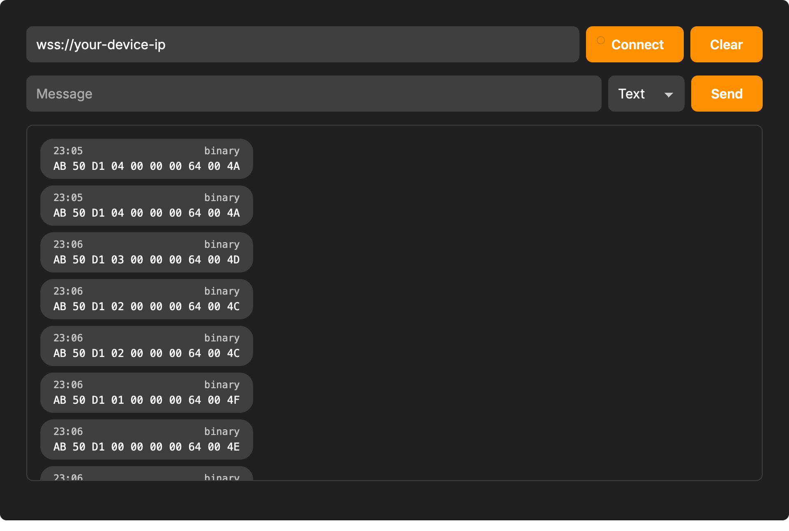

Als je zoekt naar "Online WebSocket Client", vind je talloze tools die ontworpen zijn voor webdevelopers. Ze zijn geweldig voor het testen van chat-apps of beurskoersen waar alles in JSON gaat.

Maar probeer eens een raw byte array te sturen die begint met `0x80` naar zo'n tool.

De meeste van deze tools zullen proberen je data te "repareren" (waardoor het corrupt raakt), een hoop vervangingstekens weergeven, of simpelweg de verbinding verbreken omdat de payload geen geldige UTF-8 is.

Voor een webdeveloper is dit een veiligheidsfunctie. Voor een embedded engineer is het een barrière.

---

## Waarom binair nog steeds heerst aan de edge

> In de wereld van microcontrollers telt elke byte

Op wire level is het WebSocket-protocol ([RFC 6455](https://www.rfc-editor.org/rfc/rfc6455.html)) perfect gelukkig met binaire data. Het gebruikt specifiek **Opcode 0x2** voor ruwe data. Hoewel het web is verschoven naar breedsprakige, menselijk leesbare formaten, vertrouwen embedded systemen nog steeds op binair om drie hele goede redenen:

1. **Zero-Copy Efficiëntie:** Waarom CPU-cycli verspillen op een ESP32 door `sprintf` te draaien puur om sensordata te versturen? Je kunt je struct gewoon casten naar een byte array en verzenden.
2. **Bandbreedte:** Een 32-bit integer is 4 bytes in binair. In JSON is `"value": 2147483647` 19 bytes. Over een cellulaire IoT-verbinding is dat verschil geld waard.
3. **Deterministisch Parsen:** Geen afrondingsfouten met floating-points of randgevallen bij het parsen van strings. Wat je stuurt is precies wat de ontvanger krijgt.

---

## De Tool Die "Embedded" Spreekt

Wij bouwden onze [online WebSocket tool](https://alsoft.nl/tools/websocket) omdat we een client nodig hadden die binaire data behandelt als een eersteklas burger, en niet als bijzaak.

### 1. Transparante Ontvangst

Wanneer je apparaat een binair frame stuurt, tonen wij dit in een specifiek hexadecimaal bericht. Geen "gokwerk" naar de encoding, geen kapotte karakters—gewoon de rauwe realiteit van je data.

> Onze tool toont binaire pakketten helder en duidelijk

### 2. Flexibele Input (Hex, Base64 en Meer)

Testen zou niet moeten betekenen dat je een Python-script moet schrijven puur om een pakket te formatteren. Met onze tool kun je direct schakelen tussen invoermodi:

- **Hex Modus:** Plak ruwe hex strings (bijv. `DE AD BE EF`) of gemengde formaten direct in het veld.
- **Base64/UTF-8 Binair:** Handig voor het testen van specifieke transport-encodings die door verschillende libraries worden gebruikt.
- **Tekst Modus:** Nog steeds aanwezig voor wanneer je standaard JSON-commando's moet versturen.

### 3. Duidelijk Opcode Onderscheid

We verbergen de details van het protocol niet. Onze geschiedenis-log labelt frames duidelijk als **Text** of **Binary**. Je hoeft je nooit meer af te vragen of je firmware per ongeluk een string stuurde in plaats van een byte array.

---

## De Kloof Dichten

> Betrouwbare tools zijn het fundament van stabiele IoT-integraties

Een tool hebben die binaire data begrijpt, is het verschil tussen een debug-sessie van 5 minuten en twee uur hoofdpijn. Of je nu werkt aan een custom gateway, een industriële sensor of een OTA-updatesysteem; het zien van de raw bytes is essentieel.

---

## Vastgelopen op een Protocol?

Als je een embedded systeem ontwikkelt en je WebSocket-frames komen maar niet overeen, dan kunnen wij helpen. Wij specialiseren ons in het "rommelige" middengebied waar hardware het web ontmoet.

- **Probeer de tool:** [Online WebSocket Client](https://alsoft.nl/tools/websocket)
- **Consultancy:** Van protocol-ontwerp tot firmware-implementatie, wij helpen je verbinding te maken.

📧 **Neem contact met ons op via [altug@alsoft.nl](mailto:altug@alsoft.nl)**

⚙️ **Bekijk onze [Tools](/tools)**
